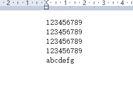

# EDFS:基于微服务架构的分布式文件系统

## 使用说明
### NameNode的启动
控制台进入NameNode目录执行：mvn spring-boot:run

参数的配置：在application.properties中修改默认参数

block.default-size=1000

block.default-replicas=2

### DataNode的启动
进入DataNode目录

mvn spring-boot:run -Dserver.port=9001

mvn spring-boot:run -Dserver.port=9002

### 模拟请求
因为没有做前端，所以使用了POSTMAN软件来发送

一共四种指令：

GET /AllFile - 列出文件系统/目录内容

GET /a.txt - 下载a.txt文件

POST /a.txt - 上传a.txt文件

DEL /a.txt - 删除a.txt文件

## 实现说明
### DataNode
DadaNode因为只负责存储和提供数据，所以只需要和NameNode交互即可，所以只有三个接口负责存文件，传文件，删文件

DataNode默认存取文件位置
```
public static String FILEDIR=new String ("E:/DFSData/");
……
……
……
……
String filePath=FILEDIR+nodeID+"/";
```

### NameNode
NameNode作为负责所有业务逻辑的节点，维护了两个数据结构，FileSystem 和 DataNodeManager

### FileSystem
以下是其数据结构图：


### DataNodeManager


### 功能实现
#### 列出目录

接到此请求后，FileSystem会将所存储的所有file名列成清单返回
***
#### 上传文件

首先NameNode的临时文件存取路径：
```
public String nameNodeTempDir="E:/DFSData/nameNodeTemp/";
```
请保证此目录存在，（并未设置强制建立，若不存在可能会出错）

接受到上传的文件后会在NameNode分块，并封装成文件保存在上述目录中，文件取名：上传的文件名（不加后缀）.blockId(0到n)

分块后会根据副本数选择DataNode发放，不过放心，临时文件会删除的。
***
#### 下载文件

这一部分是比较头疼的部分，首先NameNode从FileSystem中查询所需文件的各个块分布在哪些DataNode上，查询后向DataNode发送请求，DataNode收到请求后将文件传给NameNode，NameNode先将文件块存在本地临时目录下，然后合并各个块成为完成的文件。

***
#### 删除文件

比较简单，不赘述

## 运行截图
### 配置说明
首先，上传的文件叫a.txt

长这样：



将分块大小设置为20B 默认备份数2 开了两个DataNode

### 上传请求
以下是我在IDea输出调试得到的dataNodeManager和FileSystem的信息


以下是我在E:\DFSData\0（其中0为号DataNode）目录下的存储信息


a为文件名，后面的数字为块号

### 获取列表请求


### 下载请求
以下是PostMan的输出


以下是在E:\DFSData\nameNodeTemp目录存的临时文件（暂未作删除处理）：


### 删除操作
不太好展示，请自行尝试
